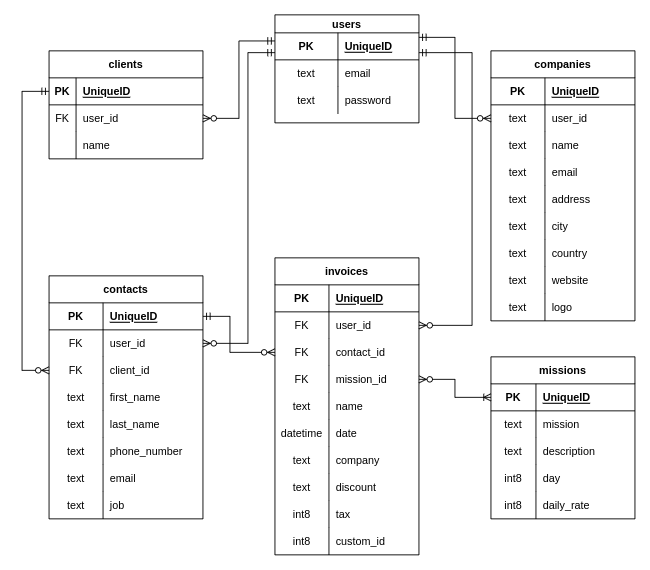
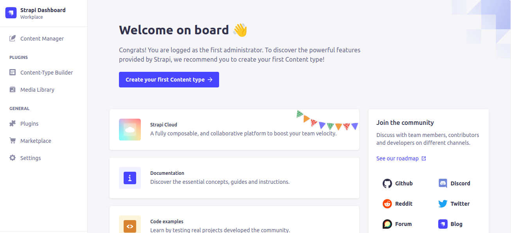
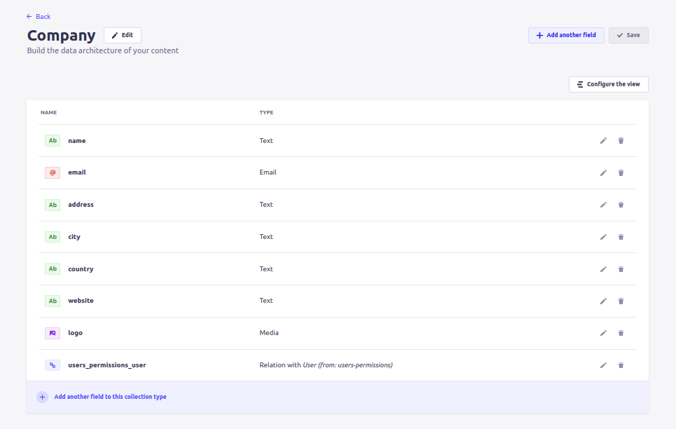
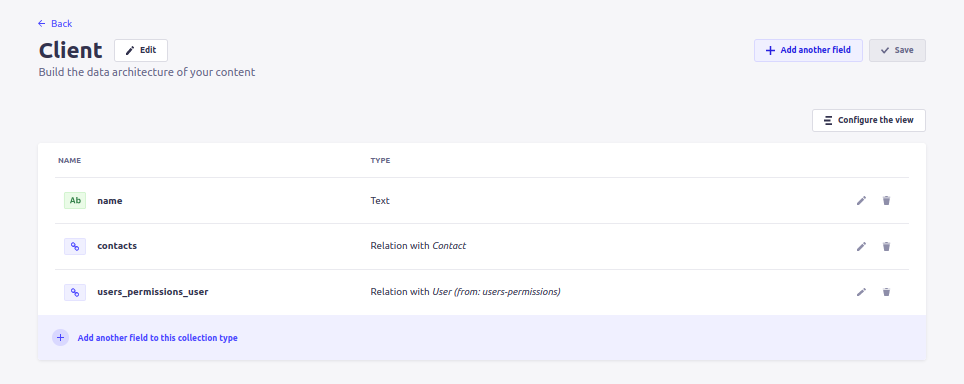
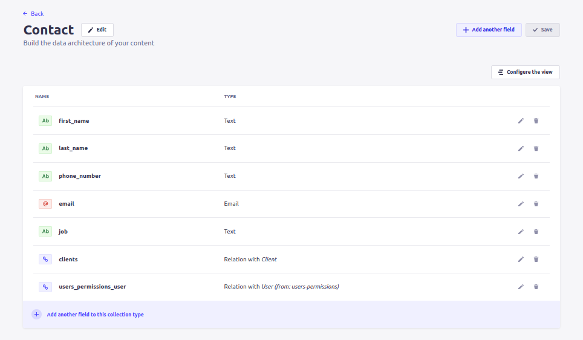

# Setting Up the App

In this episode, we initialize our **Pdf Invoice Generator** app using with the **refine** CLI Wizard and get familiar with the boilerplate code created. We also initialize our **Strapi** backend server and create the database collections we need.

This is Day 2 of the [**refineWeek**]() series. This **refineWeek** is a five-part tutorial that aims to help developers learn the ins-and-outs of **refine**'s powerful capabilities and get going with **refine** within a week.


## Overview

In the previous post, we got a preview of **refine**'s underlying architecture, especially on how **refine**'s core modules abstract and divide an app's logic inside individual providers and allow their methods to be easily accessed and invoked with hooks from inside consumer components. This abstraction at the providers layer is where **refine** shines and require extensive configuration to begin with.

In this part, we will get into the details of two important providers: namely, `dataProvider` and `authProvider` that are passed to the `<Refine />` component. We will be building on this knowledge in the coming episodes.

These two providers will be generated by the **refine** CLI wizard which allows us to interactively choose desired supplementary packages for our project. We'll use **Strapi** for our backend and **Ant Design** for the UI. So, let's start off with setting up the **Pdf Invoice Generator** app right away.
<br />


## Project Setup

For this project, we are using **Strapi** as our backend hosted in the **Strapi Cloud**. **refine** comes with an optional package for **Strapi** that gives us `dataProvider` and `authProvider`s out-of-the-box for handling requests related to CRUD actions, authentication and authorization against models hosted in a **Strapi** instance.

We are going to include **refine**'s Ant Design package for the UI side.

Let's go ahead and use the `npm create refine-app` command to interactively initialize the project. Navigate to a folder of your choice and run:

```bash
npm create refine-app@latest pdf-invoice-generator
```

The CLI wizard presents us with a set of questions for choosing the libraries and frameworks we want to work with. We'll initialize a **refine** project with `craco` to manage our configurations. We would like to generate some example pages so that we can use the boilerplate code to add our own resources and route definitions. So, I went ahead and chose the following options:

```bash
✔ Choose a project template · refine-react
✔ What would you like to name your project?: · blog-pdf-invoice-generator
✔ Choose your backend service to connect: · data-provider-strapi-v4
✔ Do you want to use a UI Framework?: · antd
✔ Do you want to add example pages?: · inferencer
✔ Do you need i18n (Internationalization) support?: · no
✔ Choose a package manager: · npm
✔ Would you mind sending us your choices so that we can improve superplate? · yes
```

This should create a rudimentary **refine** app that supports **Ant Design** in the UI and **Strapi** in the backend. If we open the app in our code editor, we can see that **refine**'s optional packages for **Ant Design** and **Strapi** are added to `package.json`:

```json
// Inside package.json

"dependencies": {
    "@refinedev/strapi-v4": "^4.0.0",
    "axios": "^0.26.1",
    "@refinedev/antd": "^5.0.0",
}
```

We are going to use **Ant Design** components for our UI thanks to the `@refinedev/antd` module. `@refinedev/strapi-v4` module allows us to use **refine**'s **Strapi** auth and data providers.

We'll cover these **Strapi** related providers more extensively as we add features to our app in the upcoming episodes. However, let's try building the app for now, and check what we have in the browser after running the development server. In the terminal, run the following command:

```bash
npm run dev
```

After that, navigate to `http://localhost:3000`, and lo and behold! we have a **refine** app:


<br />


## Exploring the App

Let's now see what **refine** scaffolded for us during initialization.

Our main point of focus is the `src` folder. And for now, especially the `<App />` component.

If we look inside the `App.tsx` file, we can see among others a `<Refine />` component crowded with passed in **props** and a child `<Routes />` component housing a series of `<Route />` subcomponents:

```TypeScript
// App.tsx

import { Authenticated, GitHubBanner, Refine } from "@refinedev/core";
import { RefineKbar, RefineKbarProvider } from "@refinedev/kbar";

import {
  AuthPage,
  ErrorComponent,
  Layout,
  notificationProvider,
} from "@refinedev/antd";
import "@refinedev/antd/dist/reset.css";

import routerBindings, {
  CatchAllNavigate,
  NavigateToResource,
  UnsavedChangesNotifier,
} from "@refinedev/react-router-v6";
import { DataProvider } from "@refinedev/strapi-v4";
import {
  CategoryCreate,
  CategoryEdit,
  CategoryList,
  CategoryShow,
} from "pages/categories";
import {
  ProductCreate,
  ProductEdit,
  ProductList,
  ProductShow,
} from "pages/products";
import { BrowserRouter, Outlet, Route, Routes } from "react-router-dom";
import { authProvider, axiosInstance } from "./authProvider";
import { Header } from "./components/header";
import { API_URL } from "./constants";
import { ColorModeContextProvider } from "./contexts/color-mode";

function App() {
  return (
    <BrowserRouter>
      <GitHubBanner />
      <RefineKbarProvider>
        <ColorModeContextProvider>
          <Refine
            resources={[
              {
                name: "products",
                list: "/products",
                create: "/products/create",
                edit: "/products/edit/:id",
                show: "/products/show/:id",
                meta: {
                  canDelete: true,
                },
              },
              {
                name: "categories",
                list: "/categories",
                create: "/categories/create",
                edit: "/categories/edit/:id",
                show: "/categories/show/:id",
                meta: {
                  canDelete: true,
                },
              },
            ]}
            authProvider={authProvider}
            dataProvider={DataProvider(API_URL + `/api`, axiosInstance)}
            notificationProvider={notificationProvider}
            routerProvider={routerBindings}
            options={{
              syncWithLocation: true,
              warnWhenUnsavedChanges: true,
            }}
          >
            <Routes>
              <Route
                element={
                  <Authenticated fallback={<CatchAllNavigate to="/login" />}>
                    <Layout Header={Header}>
                      <Outlet />
                    </Layout>
                  </Authenticated>
                }
              >
                <Route
                  index
                  element={<NavigateToResource resource="products" />}
                />
                <Route path="/products">
                  <Route index element={<ProductList />} />
                  <Route path="create" element={<ProductCreate />} />
                  <Route path="edit/:id" element={<ProductEdit />} />
                  <Route path="show/:id" element={<ProductShow />} />
                </Route>
                <Route path="/categories">
                  <Route index element={<CategoryList />} />
                  <Route path="create" element={<CategoryCreate />} />
                  <Route path="edit/:id" element={<CategoryEdit />} />
                  <Route path="show/:id" element={<CategoryShow />} />
                </Route>
              </Route>
              <Route
                element={
                  <Authenticated fallback={<Outlet />}>
                    <NavigateToResource />
                  </Authenticated>
                }
              >
                <Route
                  path="/login"
                  element={
                    <AuthPage
                      type="login"
                      formProps={{
                        initialValues: {
                          email: "demo@refine.dev",
                          password: "demodemo",
                        },
                      }}
                    />
                  }
                />
              </Route>
              <Route
                element={
                  <Authenticated>
                    <Layout Header={Header}>
                      <Outlet />
                    </Layout>
                  </Authenticated>
                }
              >
                <Route path="*" element={<ErrorComponent />} />
              </Route>
            </Routes>

            <RefineKbar />
            <UnsavedChangesNotifier />
          </Refine>
        </ColorModeContextProvider>
      </RefineKbarProvider>
    </BrowserRouter>
  );
}

export default App;
```

Take an early note of the `resources` prop. The resources and their corresponding routes are added as part of the examples that we opted for while initializing the project with the **refine** CLI Wizard. We are going to remove these resources and route definitions and add our own in the coming episodes.

Note also the presentation of the `<AuthPage />` component at the `/login` path. We will come to this in a section related to authentication on [Day Three]().

For the most part, the meat of an app is configured and built around the above indicated props and routes. Today, we'll examine a few of these props so that we are ready to move to the next episode. But let's begin with the `<Refine />` component first.

<br />


### The `<Refine />` Component

The `<Refine />` component is the entry point of a **refine** app. In order to leverage the power of **refine**'s abstraction layers, we need to have the `<Refine />` component.

Then we have to configure the `<Refine />` component with the provider objects we want to use in our app. We can see that CLI Wizard already added the `dataProvider` and `authProvider` props for us inside `<Refine />` out-of-the-box. We will be using them in our app. Some provider objects like the `notificationProvider` or the `dataProvider` are defined for us by **refine**'s core or support modules and some like the [`accessControlProvider`]() have to be defined by ourselves.

Besides, some providers such as the `authProvider` _can / have_ to be tailored according to our app's needs and some like the **Strapi**-specific `dataProvider` by `@refinedev/strapi-v4` come packaged completely and cannot be extended or modified.

<br />


### `<Refine />`'s `dataProvider` Prop

**refine**'s **data provider** is the context which allows the app to communicate with a backend API via a `http` client. It subsequently makes response data returned from HTTP requests available to consumer components via a set of **refine** data hooks.

If we look closely, the `dataProvider` prop derives a value from a call to `DataProvider()` function:

```TypeScript
// Inside App.tsx

	dataProvider={DataProvider(API_URL + `/api`, axiosInstance)}
```

The returned object, also called the **`dataProvider`** object, has the following signature:

```TypeScript
// Data provider object signature

const dataProvider = {
	create: ({ resource, variables, metaData }) => Promise,
	createMany: ({ resource, variables, metaData }) => Promise,
	deleteOne: ({ resource, id, variables, metaData }) => Promise,
	deleteMany: ({ resource, ids, variables, metaData }) => Promise,
	getList: ({
		resource,
		pagination,
		hasPagination,
		sort,
		filters,
		metaData,
	}) => Promise,
	getMany: ({ resource, ids, metaData }) => Promise,
	getOne: ({ resource, id, metaData }) => Promise,
	update: ({ resource, id, variables, metaData }) => Promise,
	updateMany: ({ resource, ids, variables, metaData }) => Promise,
	custom: ({
		url,
		method,
		sort,
		filters,
		payload,
		query,
		headers,
		metaData,
	}) => Promise,
	getApiUrl: () => "",
};
```

Each item in this object is a method that has to be defined by us or **refine**'s data provider packages.

**refine** supports [15+ backend](https://refine.dev/integrations/) `dataProvider` integrations as optional packages that come with distinct definitions of these methods that handle CRUD operations according to their underlying architectures. The full list can be found [here](https://refine.dev/docs/packages/list-of-packages/#data-provider-packages).

Normally, for our own backend API, we have to define each method we need for sending `http` requests inside a `dataProvider` object as above. But since we are using the `@refinedev/strapi-v4` package, `dataProvider={DataProvider(API_URL + `/api`, axiosInstance)}` makes the following object available to us:

```TypeScript
// Inside node_modules/@refinedev/strapi-v4/src/dataProvider.ts
// version 4.1.0

export const DataProvider = (
    apiUrl: string,
    httpClient: AxiosInstance = axiosInstance,
): Required<IDataProvider> => ({
    getList: async ({ resource, pagination, filters, sorters, meta }) => {
        const url = `${apiUrl}/${resource}`;

        const {
            current = 1,
            pageSize = 10,
            mode = "server",
        } = pagination ?? {};

        const locale = meta?.locale;
        const fields = meta?.fields;
        const populate = meta?.populate;
        const publicationState = meta?.publicationState;

        const quertSorters = generateSort(sorters);
        const queryFilters = generateFilter(filters);

        const query = {
            ...(mode === "server"
                ? {
                      "pagination[page]": current,
                      "pagination[pageSize]": pageSize,
                  }
                : {}),
            locale,
            publicationState,
            fields,
            populate,
            sort: quertSorters.length > 0 ? quertSorters.join(",") : undefined,
        };

        const { data } = await httpClient.get(
            `${url}?${stringify(query, {
                encodeValuesOnly: true,
            })}&${queryFilters}`,
        );

        return {
            data: normalizeData(data),
            // added to support pagination on client side when using endpoints that provide only data (see https://github.com/refinedev/refine/issues/2028)
            total: data.meta?.pagination?.total || normalizeData(data)?.length,
        };
    },

    getMany: async ({ resource, ids, meta }) => {
        const url = `${apiUrl}/${resource}`;

        const locale = meta?.locale;
        const fields = meta?.fields;
        const populate = meta?.populate;
        const publicationState = meta?.publicationState;

        const queryFilters = generateFilter([
            {
                field: "id",
                operator: "in",
                value: ids,
            },
        ]);

        const query = {
            locale,
            fields,
            populate,
            publicationState,
            "pagination[pageSize]": ids.length,
        };

        const { data } = await httpClient.get(
            `${url}?${stringify(query, {
                encodeValuesOnly: true,
            })}&${queryFilters}`,
        );

        return {
            data: normalizeData(data),
        };
    },

    create: async ({ resource, variables }) => {
        const url = `${apiUrl}/${resource}`;

        let dataVariables: any = { data: variables };

        if (resource === "users") {
            dataVariables = variables;
        }

        const { data } = await httpClient.post(url, dataVariables);
        return {
            data,
        };
    },

    update: async ({ resource, id, variables }) => {
        const url = `${apiUrl}/${resource}/${id}`;

        let dataVariables: any = { data: variables };

        if (resource === "users") {
            dataVariables = variables;
        }

        const { data } = await httpClient.put(url, dataVariables);
        return {
            data,
        };
    },

    updateMany: async ({ resource, ids, variables }) => {
        const response = await Promise.all(
            ids.map(async (id) => {
                const url = `${apiUrl}/${resource}/${id}`;

                let dataVariables: any = { data: variables };

                if (resource === "users") {
                    dataVariables = variables;
                }
                const { data } = await httpClient.put(url, dataVariables);
                return data;
            }),
        );

        return { data: response };
    },

    createMany: async ({ resource, variables }) => {
        const response = await Promise.all(
            variables.map(async (param) => {
                const { data } = await httpClient.post(
                    `${apiUrl}/${resource}`,
                    {
                        data: param,
                    },
                );
                return data;
            }),
        );

        return { data: response };
    },

    getOne: async ({ resource, id, meta }) => {
        const locale = meta?.locale;
        const fields = meta?.fields;
        const populate = meta?.populate;

        const query = {
            locale,
            fields,
            populate,
        };

        const url = `${apiUrl}/${resource}/${id}?${stringify(query, {
            encode: false,
        })}`;

        const { data } = await httpClient.get(url);

        return {
            data: normalizeData(data),
        };
    },

    deleteOne: async ({ resource, id }) => {
        const url = `${apiUrl}/${resource}/${id}`;

        const { data } = await httpClient.delete(url);

        return {
            data,
        };
    },

    deleteMany: async ({ resource, ids }) => {
        const response = await Promise.all(
            ids.map(async (id) => {
                const { data } = await httpClient.delete(
                    `${apiUrl}/${resource}/${id}`,
                );
                return data;
            }),
        );
        return { data: response };
    },

    getApiUrl: () => {
        return apiUrl;
    },

    custom: async ({
        url,
        method,
        filters,
        sorters,
        payload,
        query,
        headers,
    }) => {
        let requestUrl = `${url}?`;

        if (sorters) {
            const sortQuery = generateSort(sorters);
            if (sortQuery.length > 0) {
                requestUrl = `${requestUrl}&${stringify({
                    sort: sortQuery.join(","),
                })}`;
            }
        }

        if (filters) {
            const filterQuery = generateFilter(filters);
            requestUrl = `${requestUrl}&${filterQuery}`;
        }

        if (query) {
            requestUrl = `${requestUrl}&${stringify(query)}`;
        }

        if (headers) {
            httpClient.defaults.headers = {
                ...httpClient.defaults.headers,
                ...headers,
            };
        }

        let axiosResponse;
        switch (method) {
            case "put":
            case "post":
            case "patch":
                axiosResponse = await httpClient[method](url, payload);
                break;
            case "delete":
                axiosResponse = await httpClient.delete(url, {
                    data: payload,
                });
                break;
            default:
                axiosResponse = await httpClient.get(requestUrl);
                break;
        }

        const { data } = axiosResponse;

        return Promise.resolve({ data });
    },
});
```

We don't have to get into the mind of the people at **refine** yet, but if we skim over closely, the `dataProvider` object above has pretty much every method we need to perform all CRUD operations against a **Strapi** backend. Under the hood, all these methods implement RESTful conventions and are tied up with appropriate RESTful resources and routes thanks to **refine**'s sensible defaults.

Notable methods that we are going to use in our app are: `create()`, `getOne()`, `getList()` and `update()`. Also notice that the `@refinedev/strapi` package uses `axios` to communicate with the **Strapi** server.

For the details of how these methods work, please take your time to scan through the [`dataProvider` API reference](https://refine.dev/docs/api-reference/core/providers/data-provider/).


In order to get the **Strapi** `dataProvider` object to deliver, we have to pass an `axios` instance and the `API_URL` of the **Strapi** server we are running as our backend.

We are importing `axiosInstance` from the `authProvider.ts` file which also houses our `authProvider` object. We'll consider the `authProvider` prop in the next section, but for the `API_URL`, we will have to set up a **Strapi** server before we can modify the `src/constants.ts` file:

```TypeScript
// src/constants.ts

export const API_URL = "https://api.strapi-v4.refine.dev";
export const TOKEN_KEY = "strapi-jwt-token";
```

We'll come to this in on [Day 3](), but let's look at the `authProvider` prop now.

<br />

### `<Refine />`'s `authProvider` Prop

We can clearly see in our `<Refine />` component that the **refine** CLI Wizard already enabled the `authProvider` prop by passing in the corresponding object for us:

```TypeScript
// Inside App.tsx

<Refine 
	authProvider={authProvider}
/>
```

Earlier on, the `authProvider` object was created by the CLI Wizard inside the `authProvider.ts` file:

```TypeScript
import { AuthBindings } from "@refinedev/core";
import { AuthHelper } from "@refinedev/strapi-v4";

import { API_URL, TOKEN_KEY } from "./constants";

import axios from "axios";

export const axiosInstance = axios.create();
const strapiAuthHelper = AuthHelper(API_URL + "/api");

export const authProvider: AuthBindings = {
  login: async ({ email, password }) => {
    const { data, status } = await strapiAuthHelper.login(email, password);
    if (status === 200) {
      localStorage.setItem(TOKEN_KEY, data.jwt);

      // set header axios instance
      axiosInstance.defaults.headers.common[
        "Authorization"
      ] = `Bearer ${data.jwt}`;

      return {
        success: true,
        redirectTo: "/",
      };
    }
    return {
      success: false,
      error: new Error("Invalid username or password"),
    };
  },
  logout: async () => {
    localStorage.removeItem(TOKEN_KEY);
    return {
      success: true,
      redirectTo: "/login",
    };
  },
  onError: async (error) => {
    console.error(error);
    return { error };
  },
  check: async () => {
    const token = localStorage.getItem(TOKEN_KEY);
    if (token) {
      axiosInstance.defaults.headers.common[
        "Authorization"
      ] = `Bearer ${token}`;
      return {
        authenticated: true,
      };
    }

    return {
      authenticated: false,
      error: new Error("Not authenticated"),
      logout: true,
      redirectTo: "/login",
    };
  },
  getPermissions: async () => null,
  getIdentity: async () => {
    const token = localStorage.getItem(TOKEN_KEY);
    if (!token) {
      return null;
    }

    const { data, status } = await strapiAuthHelper.me(token);
    if (status === 200) {
      const { id, username, email } = data;
      return {
        id,
        name: username,
        email,
      };
    }

    return null;
  },
};
```

<br />

This object has all the methods we need to implement an email / password based authentication and authorization system in our app.

Notice, as mentioned before, that `authProvider` relies on **Strapi** `API_URL` to connect to our **Strapi** database. So, in this case, our `authProvider` was generated as part of the **Strapi** package.

As we can infer by now, although we have stated that **refine** performs and manages a lot of heavylifting and simplifies the app logic by dividing concerns into separate contexts, providers and hooks, _configuring_ all these providers is a heavy task itself.

It, fortunately, makes configuration easier by composing individual providers inside a single object.

These are pretty much the essentials we should get familiar with in order to start adding `resources` to the `<Refine />` component. Prior to that though, let's go ahead and spin up a **Strapi** server add some collections to store our data.

<br />

## refine with a Strapi Backend

For this app, we are going to have several collections in stored with the **Strapi** backend server. The entity relational diagram looks like this:




As we can see from the ERD, a `user` has a `has many` optional relationship with all other entities.

We deal with the `missions` and `invoices` collections on [Day 4](), but today we are concerned with setting up only the `companies`, `clients` and `contacts` collections. The relationship between a `client` and `contacts` is also `has many` optional, i.e., a `client` can have many `contacts`.

With this in mind, let's go ahead and initialize a **Strapi** project.

<br />

### Setting Up Strapi Instance

We'll initialize a local **Strapi** project first and then create the above mentioned collections. In order to create a local **Strapi** instance, go to the folder of your choice and run the following command from the terminal:

```bash
npx create-strapi-app@latest pdf-invoice-generator --quickstart
```

Useful details for creating a **Strapi** project is available in this [quickstart guide](https://docs.strapi.io/dev-docs/quick-start).

After successful initialization, this will have a **Strapi** project created and spun up at `http://localhost:1337`.

<br />

### Setting Up Admin User for Strapi

Next, we have to be able to access the **Strapi** Admin UI that is hosted locally in our machine. So, we have to register an admin user. If you are not already familiar with creating an admin user, please follow [this section of the guide](https://docs.strapi.io/dev-docs/quick-start#step-2-register-the-first-administrator-user).

The admin dashboard at `/admin` after signing up and logging in should look something like this:



Having access to the **Strapi** admin dashboard, we are ready to go ahead and create our collections.

<br />

### Creating Strapi Collections

We can create collections using the `Content-type Builder` plugin available in the **Strapi** admin dashboard. More details are available in [this section](https://docs.strapi.io/dev-docs/quick-start#step-1-create-collection-types-with-the-content-type-builder) of the **Strapi** quickstart guide.

**Users Collection**

The `users` collection is already created when we initialize a **Strapi** instance. It is available under the `users-permissions.user` collection type.

<br />

**Companies Collection**

The `companies` collection should look like this:



Notice that `users_permissions.users` collection has a `has many` optional relation with `companies`.

<br />

**Clients Collection**

The `clients` collection looks like this:



The `users-permissions.users` collection has a `has many` optional relationship with `clients` as well. `clients`, in turn, has a `has many` optional relation with `contacts`.

<br />

**Contacts Collection**

The `contacts` collection should look as below:



`users_permissions.users` collection also has a `has many` optional relation with `contacts`.

With these set up, we need to create an app user and set roles for authenticated users to access the **Strapi** data. Let's do that next.

### Setting Up Roles for Strapi

We need to use the `Content Manager` plugin to create a app user. I have created my user, please go ahead an create yours.

We only want our app users to access the CRUD actions when authenticated. So, let's set the appropriate permissions from `Settings >> USERS & PERMISSIONS >> Roles. More details are available in [this section of the **Strapi** quickstart guide](https://docs.strapi.io/dev-docs/quick-start#step-3-set-roles--permissions).


With all these completed, we are now ready to start adding `resources` to our **refine** app.

## Summary

In this post, we went through the process of initializing our **Pdf Invoice Generator** app with a **Strapi** backend and **Ant Design** UI framework.

We then explored the boilerplate code created by **refine** CLI Wizard, especially the files related to `dataProvider` and `authProvider` props of the `<Refine />` component. We touched on setting up a **Strapi** `axiosInstance` which is used by these providers to send HTTP requests to the **Strapi** backend.

We also set up the **Strapi** backend app, its API Token, most of our collections and also specified permissions for the `authenticated` role.

In the next episode, we add `resources` so that we can connect our **refine** app to the **Strapi** server and then implement CRUD operations on our **Pdf Invoice Generator** app.
